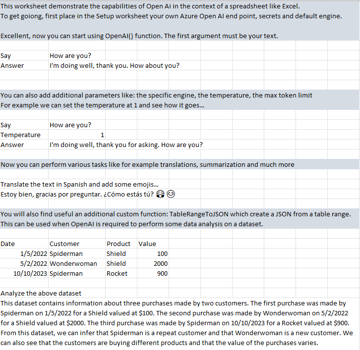
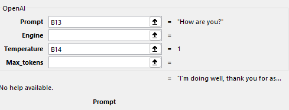

# ExcelGPTPro

**ExcelGPTPro** is a project aimed at integrating OpenAI's GPT models directly into Excel. This allows users to perform complex tasks such as translating, summarizing, and extracting information from text, as well as generating new text and analyzing datasets (both numeric and textual) within their Excel environment.

Efficient use of resources is a key focus of this project. We use a local caching system to minimize unnecessary calls to the OpenAI service, reducing costs and maintaining optimal performance and speed in the user's workflow.

## Project Status

This project is currently in its initial stage of development. We have completed our first draft of the standalone VBA version, which is now available for use. Contributions and feedback are highly welcomed and appreciated.

## Demonstration Video

See ExcelGPTPro in action in this [demonstration video](https://www.veed.io/view/f1c63389-762b-4f8f-babb-ebe7988e62d4?panel=share).

## Project Versions

We have released the following modules and plan further developments:

1. **Standalone VBA Version (Now Available)**: This is a standalone module that any user with access to OpenAI GPT service will be able to use. OpenAI secrets will be provided by the user and stored locally. To use this version, please navigate to the `vba` folder and read the README.md for specific instructions. This version comes with examples and, while in its first draft, is fully functional.

We continue to plan for the following releases:

2. **Standalone TypeScript Version**: The second phase of the project will produce a TypeScript version of the module. Like the VBA version, this version will also be completely standalone and users will be able to run it locally. More details will be provided as development progresses.

3. **Managed Version**: The third phase will introduce a backend engine that allows users to register and store their credentials remotely. This version will be managed by an Azure Function and will offer both VBA and TypeScript front ends. More details will be provided as development progresses.

## Getting Started

The standalone VBA version is currently available. To get started with it, navigate to the `vba` folder and follow the instructions in the README.md file. It includes examples to help you understand its functionality and usage.

*Screenshot showing the first page of the Helloworld example file.*

*Details of the OpenAI function and the available parameters*

